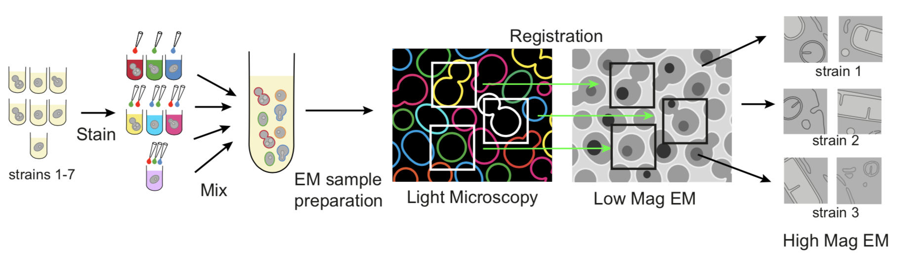

# MultiCLEM scripts

This repository contains MatLab scripts neccessary for performing image processing and imaging for the method described in the paper:

**Multiplexed electron microscopy by fluorescent barcoding allows
screening for ultrastructural phenotype** by Yury S. Bykov, Nir Cohen _et al_.

To start, copy the repository to a folder on your computer and refer to documentation ( `./docs` folder) for further instructions.

To run the scripts you need Matlab with Image processing and Statistics Toolboxes. Contact us if you don't have it - we can compile a standalone application for you. 

