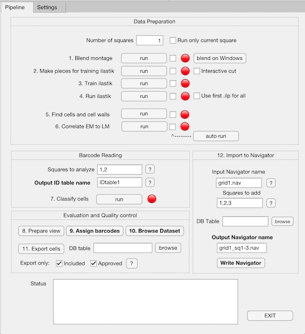
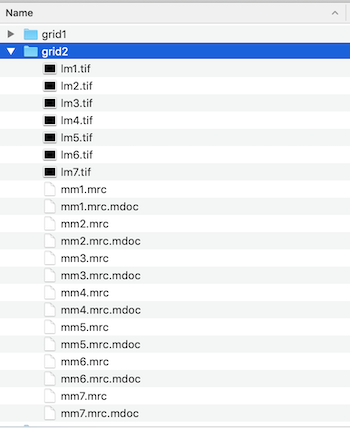

#MultiCLEM: imaging and analysis documentation

**Yury S. Bykov, Nir Cohen, et al. 2019**.

This document outlines practical aspects of the yeast barcoding CLEM protocol, excluding the staining part described in a separate protocol. Here we describe how to setup electron microscopy imaging of barcoded samples and how to use software to do correlation and analyze the data. Detailed description is provided for each Matlab function and user interface.

[TOC]

## Workflow outline

1. Grow strains and barcode them

2. Prepare electron microscopy (EM) sample

3. Image the EM sample under light microscope (LM)

4. Image the EM sample with medium magnification (MM) EM

5.  Processing:

   - Segment MM EM data

   - Correlate EM and LM

   - Determine barcode

   - Barcode and EM quality control and cell selection

   - Cell coordinate import back into EM

6. High magnification (HM) EM imaging

This manual covers steps 3-6. For barcoding protocol refer to the Supplementary protocol, for EM sample preparation refere to the cited literature.


##Fluorescence microscopy

Fluorescent microscopy is performed as described before (Kukulski et al., 2012). Collect 4-10 grid square images per grid. 


## Low/Medium magnification EM

1. Stain Grids with Reynold's lead citrate to enhance contrast.

    a.  Place a piece of parafilm in a Petri dish.

    b.  Spread KOH pellets around it. For each grid, put a droplet of lead citrate which was spinned in a tabletop centrifuge (5 min, maximal rpm) or filtered through a 0.2 um nitrocellulose filter.

    c.  Next to the lead citrate droplets, place three distilled water droplets per grid.

    d.  Put the grids on top of the lead citrate droplets with sections facing down. Avoid breathing on the dish.

    e.  Incubate the grids on droplets for 2-15 minutes depending on section rhickness with the closed Petri dish lid. Thin sections (less than 100 nm) require 2 min incubation; semi-thin sections (300 nm) require 15 min incubation.

    f.  Wash the grids on water droplets, blot with filter paper and let dry.

2. Insert the grid in the microscope, start SerialEM, open a new Navigator file. It is preferable to have at least SerialEM 3.6, but 3.7 is much better.

3. Identify the grid squares imaged by fluorescence microscopy. Add their centers positions as Navigator items. You can do this by setting up a full grid map and clicking the centers of the squares on this map or by finding the square centers on the fluoscreen by moving the stage and adding stage positions as Navigator points.

4. Choose the magnification for square mapping. Insert and align objective aperture if necessary. We usually use the lowest magnification in the 'M' mode on the FEI microscopes. The pixel size should be around 4 nm, adjust it depending on how big the montage you can tolerate and how many details you want to see already in the montage. 

5. If you plan to do the protocol completely and image individual cells at higer magnification after determining their barcode, make sure that a montage acquired at your chosen magnification is suitable for 'Realign to Item' procedure. For this add point in the middle of a cell, switch to the desired higher magnification and run 'Realign to Item'. Fot this to work, SerialEM calibrations need to be done correctly after it was installed.

6. Setup a montage acquisition at the center of each square of interest. For a 4000x4000 camera it takes 6x6 montage to image a whole square of the 200 mesh grid with the pixel size around 5 nm. Preferably, no cells should be missing from the map and the edges of the grid square should be visible. Select an option to save each motage as a separate `.mrc` stack for each square and make it a map. Name them in the same way with letters (root name) followed by a square number. Example: `sq1.mrc`,  `sq2.mrc`, `sq3.mrc` _etc_. Select an option to save an `.mdoc` file with metadata.

    

## Map processing, correlation, and barcode determination: software manual

The processing step aims to find cell cross-sections on the medium magnification montages, correlate these cells to the fluorescence microscopy data, determine cell barcodes and add cell coordinates to the SerialEM navigator so that high-resolution data can be acquired later. Here we provide a workflow overview followed by a detailed description of all processing steps.

### Overview

The pipeline is operated through Matlab. On the top level there is a GUI which calls `muclem_` functions stored in the `./functions` folder. Some of these functions also call external programs like IMOD and _ilastik_. 

In this manual we explain how a function for each step works, which arguments it has and what results it generates and try to give suggestions for troubleshooting.

If GUI doesn't work, functions can be called directly from the command line or organized in a script.

Before starting copy the data for each EM grid in a separate directory. This is a working directory where all the commands will be executed.

The workflow is separated in four stages: Data Preparation, Analysis, Evaluation and Quality control, and Coordinate export to EM. In the GUI, this is reflected by the four separate panels in the 'Pipeline' tab. Each panel contains buttons to execute individual scripts. Additional settings for each step are set up using the 'Settings' tab.



At the **Data Preparation stage**, the images for each grid square are processed separately. Montages, `.mdoc` files and LM data for each square are automatically copied to a separate directory within the working directory. Then IMOD is used to blend the montages and convert files from `.mrc` to `.tif`. Small portions of each montage are cut out to manually train ilastik software to segment out cell cross-sections. Then _ilastik_ is run in headless mode to segment the complete montages. The output from ilastik segmentation is further processed in Matlab to locate individual cells, save their centers and outlines. At his point already, the centers can be imported back to the Navigator file if all cells are to be imaged in higher magnification independent of their barcodes. To determine the cell barcodes EM and LM data need to be correlated because the LM signal is too variable for the segmentation of individual cells. The correlation is performed using Matlab control point selection tool. LM data is transformed to the size of EM data and the cell outlines determined from the segmented montage are later used as masks to measure fluorescence signal of yeast cell walls.

The **Analysis** stage is performed simultaneously for a group of grid squares specified by a list. Using the fluorescence signal in each channel, cells are automatically classified by their barcodes. The result of the classification is written to the file called ID Table. To simplify the evaluation stage and make subsequent analysis more flexible, the images of individual cells are cropped out from large micrographs and stored in a separate folder.

The **Evaluation and Quality** control stage has two steps. First, a small number of cells with each barcode are displayed and the user needs to assign which channels have signal and which don't for each label. This is done manually to better assess the quality of the classification. On the second step the dataset is sorted by barcode and the user can browse through the cell images and exclude cells with bad fluorescence signal or sample quality and correct wrongly assigned barcodes. The result of this evaluation is written to the file called Database Table (DB Table).

Finally, coordinates of cells can be imported to the navigator file for high magnification imaging using EM. Previously generated DB Table can be used to add only selected cells.

### Installation

To run the scripts, you will need Matlab (we worked with versions starting R2016b and did not test backward and forward compatibility) with the Image processing and Statistics toolboxes, IMOD package for EM data processing and _ilastik_ segmentation software. Everything can run on Windows, Mac, and Linux.

Install IMOD according to the instructions depending on your operating system. Use Cygwin for installing on Windows (https://bio3d.colorado.edu/imod/download.html). 

IMOD paths should be visible to Matlab. We noticed that on Mac they might not be visible when MatLab is launched by clicking the icon; we never encountered this problem if MatLab is launched from the command line. To make sure Matlab can call IMOD commands and see IMOD paths, run some IMOD command through Matlab command line using system(), for example `system('mrc2tif')` or check if IMOD environmental variables are setup (run `system('echo $IMOD_DIR')` on Unix). If Matlab can't call IMOD try launching Matlab from the command line:

- Find location of the matlab executable by typing `matlabroot` in MatLab command window. For example:

  ```matlab
  >> matlabroot
  
  ans =
  
  /Applications/MATLAB_R2016b.app
  ```

- Close MatLab and start it from the Mac Terminal by typing the `matlabroot` value followed by `/bin/matlab`. Foe example:

  ```bash
  yuryb$ /Applications/MATLAB_R2016b.app/bin/matlab
  ```

Install Ilastik according to the manual ([www.ilastik.org](http://www.ilastik.org)). When you start the MultiCLEM GUI provide the path to ilastik folder (containing run scripts for different operating systems) in the 'Settings' tab of the GUI. On Mac this is something like `/Applications/ilastik-1.3.2rc2-OSX.app/Contents/ilastik-release/`. On Linux it is just the folder which you download from their website that contains `run_ilastik.sh`.

To run the GUI from its location without installing into MatLab:

1. Add directory containing the scripts to the Matlab path by typing this in MatLab command line: `addpath('path-to-MultiCLEM-scripts/functions')`. 
2. Launch `MultiCLEM_analyzer.mlapp` by typing `'path-to-MultiCLEM-scripts/MultiCLEM_analyzer.mlapp'`

Or

Install the app from `path-to-MultiCLEM-scripts/mlpkg`. In this case all functions will be copied to the matlab home directory and an icon of the app will appear among your other matlab apps. You can start the GUI by clicking this icon. The installed app will use the copy of the scripts stored in the home directory, in case you want to modify them.

### Initial data organization and setup

All the data from one EM grid should be put in a separate directory and named in a systematic way. Grid square maps in mrc format should be named `square_rootN.mrc`, where square\_root is some letter combination (like sq, mm etc), and N is the square number without zero padding (1,2,3.. not 01,02,03). Make sure that SeriaEM automatically names .mdoc files as `square_rootN.mrc.mdoc` in the required way.  Do not rename the files at later points. The light microscopy data should be organized as one tiff stack (slices are channels) per one grid square and named systematically using a different root name (like 'lm' or 'fm'). An example of initial folder set up for a grid with 7 squares imaged:



In the 'Settings' tab the path to the working directory ('Grid dir') and root names for light and electron micrographs should be provided. **Almost all** **additional files and folders created during processing are named automatically and the names cannot be changed.** Only three output files (ID table, DB table, and output navigator) are named by user, see below for details. Files related to individual squares are stored in the square directories (named `sq1`, `sq2`, etc). Files related to the whole dataset are saved in the working directory. All generated files are listed in the descriptions of individual steps below.


### Panel 1. Data preparation

At this stage squares are processed by each script sequentially or individually. For sequential processing enter the last square number in the field 'Number of squares'. The action will be performed starting with square 1 and ending with the square with the specified number. For individual processing tick the box 'Run only current square'. In this case the action will be performed on the square with the number entered in the box.

The scripts can be added to autorun sequence by ticking boxes to the right of each run button. Hitting the autorun button is equivalent to sequentially hitting the run buttons of individual ticked steps.

The path to working directory should be pasted in the field 'Grid dir' in the 'Settings' tab.


#### Step 1. Montage blending

Function name:  `muclem_autoblend.m`

Arguments:

-   sq\_num - current grid square number (from the file name), integer

-   work\_dir - working directory, char

-   mrc\_root - name root for the initial `.mrc` grid square map, char. Examples: ‘mm’, ’sq'

-   LM\_root - name root for the lm data, char. Example: ‘lm'

-   nosorting\_LM - sort or not to sort LM data into grid square subfolders, boolean

The script creates a processing directory for each grid square and sorts .mrc and .mdoc files into these directories. Fluorescent micrographs are sorted if 'Sort LM' is ticked. Sometimes this is necessary if LM data is copied to the grid directories manually from another source.

In each directory Matlab calls IMOD commands _extractpieces_, _blendmont_ and _mrc2tif_. Additional (to input/output files and names) options for blendmont are hard-coded and are the following:

**-v** (VerySloppyMontage -- when opening the maps in SerialEM, in the Montage control panel select option 'Treat as a very sloppy montage' so that the map looks more like the blended version)

**-ori** (AdjustOrigin, we use it because it is used when blending using etomo GUI)

**-robust 1.0** (Ignore the outliers to get better blending of the pieces where the grid bars ruin the correlation)

These options provide the best blending of medium magnification montages of complete grid square maps with yeast sections. For other types of samples or different magnifications these parameters might need adjustment.

**Generated files** (for grid square number 1) in the square folder:

​	`sq1.pl`, `sq1.ecd`, `sq1.xef`, `sq1.yef` - technical files for blending

​	`sq1_autoblend.mrc` - blended montage in mrc format (full size)

​	`sq1.tif` - blended montage converted to tif (full size)

​	`sq1_stack.tif` - individual montage tiles converted to tif in one stack


#### Step 2. Make pieces for training ilastik

Function name: `muclem_cutout.m`

Arguments:

-   sq\_num  - current grid square number (from the file name), integer

-   tlX - top left corner X coordinate of top left tile (out of 4) to be cut out, integer. Example: 1500

-   tlY - top left corner Y coordinate of top left tile (out of 4) to be cut out, integer. Example: 1500

-   cutsize - length of side of one cut tile. Example: 1500

-   interact\_cut - If the script will show where tiles are positioned and ask user to change coordinates tax and lxY, boolean

-   work\_dir - working directory, char

The script crops five small images from each square montage and saves them in separate folders (one for each square, in the working directory), so that ilastik project can be created for each individual square and the ilastik software can be trained by user using these small images and not the fullsize montage which is difficult to handle in the ilastik GUI.

Four of the five saved images are cropped at the positions determined by the `tlX` and `tlY` parameters entered in the 'Settings' tab in Panel 2. These are coordinates of the top left corner of the first (top left) image. The next three images are cut to the right and to the bottom from it. The fifth image is always cut in the center of the square because sometimes the image intensity has gradients across the montage causing bad segmentation. The size of the images is specified by the `cutsize` parameter entered in the same panel. If the `Interactive cut` checkbox next to the run button is ticked, positions of the first four images to be cut from each square montage will be shown to the user along with a window to type the corrected coordinates. The user needs to correct the position of the images to make sure that the images contain: a piece of the grid bar, good well preserved cells, holes in the resin, resin itself. If the box is not ticked, the images are cropped at the same coordinates for all squares. The script uses IMOD command _trimvol_ to cut pieces from the original.

**Files and folders** generated in the working directory (for square 1):

​	`4ilastik_sq1/sq1_tile1.tif`

​	`4ilastik_sq1/sq1_tile2.tif`

​	`4ilastik_sq1/sq1_tile3.tif`

​	`4ilastik_sq1/sq1_tile4.tif`

`4ilastik_sq1/sq1_tile5.tif`


#### Step 3. Train ilastik

The Matlab code calling ilastik is in the main App file. For each square it launches the ilastk run script from the ilastik setup folder specified in the 'Settings' tab. For each square it automatically opens a new project sqN.ilp saved in the corresponding 4ilastik\_sqN subfolder (N -- square number). The user needs to add images to the project. Despite the project is saved in the correct folder for each square, default folder opened to select images might always belong to square 1. Be careful to select images from correct folder for each project.

If the imaging conditions for all squares were consistent, one might try to create only one project to segment all squares. Create a project for the first square and add all images for training from other folders. If the training works well, use the option 'Use first .ilp for all' to run ilastik later (step 4).

Select all features for classification and add 4 labels: cells, holes, grid bar and resin. Mark good, well preserved cells with cell labels, dark areas, folded cells, and grid bars with grid bar label, holes in the resin with hole label and resin with resin label. Make sure by switching to tile5 that resin is correctly recognized in the center of the montage. Save the project and exit. Make a note of which label has which number (numbered in order of creation). Enter this information in the 'ilastik labels' panel in the 'Settings' tab. Labels should be consistent for all squares/ilastik projects.

Additional help is available on ilastik.org.

Generated files (for square number 1):

`4ilastik_sq1/sq1.ilp` - ilastik project file

#### Step 4. Run ilastik

The Matlab code calling ilastik is in the main App file. It uses previously saved projects trained on small subset of montages to segment the fullsize montage in headless mode. If one project was created for all squares (see Step 3), use the option 'Use first .ilp for all'.

Segmentation of the fullsize montage can take considerable time depending on the number of CPUs and memory available. On a computer with 4 CPUs and 16 GB of memory one 20000x20000 pixel montage segmentation can take around 15 min. So it's better to do training step for all squares first and then to launch segmentation so that it can run uninterrupted for all the squares while you do something else.

Generated files (for square number 1), in the square folder sq1:

`sq1_Simple Segmentation.tif` -- image size of the full montage where each pixel is given value 1-4 marking good cells, resin, holes and dark areas.

#### Step 5. Find cells and cell walls

Function name: `muclem_segment_montage.m`

Arguments:

-   sqnum - current grid square number (from the file name), integer
-   EMscale - coefficient to reduce the size of the original EM montage to speedup the processing, double. Example: 0.15-0.25 works good.
-   holesize - size of holes that need to be filled after initial segmentation in µm^2. Example: 0.5
-   wshH - coefficient for watershed segmentation, integer. Use 1.
-   area\_min - minimal area of an object to count as a yeast cell, µm^2, double. Example: 1.0
-   circ\_min - minimal circularity of an object to count as a yeast cell, double. Example: 0.8 (range 0-1.0).
-   work\_dir - working directory, char
-   mrc\_root - name root for the initial `.mrc` grid square map, char. Examples: ‘mm’, ’sq'
-   lbl\_cells - label number for good cells in ilastik segmentation, integer. Example: 1
-   lbl\_holes- label number for resin holes in ilastik segmentation, integer. Example: 2
-   lbl\_black - label number for dark regions in ilastik segmentation, integer. Example: 3
-   show\_more - show intermediate processing steps, boolean.
-   r1 - radius of structured element used to smoothen cell outlines, nm. Example: 300
-   dilate - radius of structured element used to increase the thickness of cell outlines, nm. Example: 200

This step takes the segmentation made by ilastik and determines coordinates and outlines of individual cell cross-sections. The initial ilastik segmentation is split in three binary images corresponding to segmented cells, holes, and black (electron-dense) areas. Labels corresponding to these regions should be correctly provided in the 'ilastik labels' panel of the 'Settings' tab. All images are scaled down by the factor 'Reduce EM' (EMscale, usually 0.2-025) to speed up the computation. All image outputs are written at the scaled down size.

The binary images are subsequently processed using Matlab image processing toolbox commands. The parameters important for all steps are entered in the panel 5. of the 'Settings' tab. The option 'Show all intermediate images' turns on display of the intermediate image processing steps making easier troubleshooting and parameter adjustment.

The binary image of cells is cleaned up from small holes (like lipid droplets) inside the cells, threshold for the hole size (in square microns) is set by the parameter 'Hole size'. It is important to remove the holes created by lipid droplets, but not to remove the holes between neighboring cells contacting each other (these holes are usually much larger than lipid droplets). If you notice many of the spaces between cells being filled leading to incorrect segmentation - deacrease the hole size parameter. 

After the cleanup, cell edges are smoothened by the morphological opening operation. The size of details removed is determined by the 'Smoothing R' parameter (r1). The resulting image is subjected to watershed segmentation to separate touching cells from each other. In most cases watershed  also separates buds from mother cells.

Segmentation leaves a number of disconnected objects, most of which are cells. Before selecting the 'cell-like' objects by size and circularity, their outlines are created and stored. The thickness of the outline which would determine the thickness of the mask applied to the FM data depends on the 'Dilation R' parameter. If the correlation is not very precise, one might increase this parameter to make the area covered by the mask larger allowing to get more signal (this will be only clear after corralation is done, of course). Outlines of holes and black areas are also stored to use for correction. Outlines of all other objects including holes and black areas are subtracted from each individual cell outline to prevent intersections of fluorescence signals.

Final selection of cells is made based on size and circularity thresholds ('Min area' and 'Min circularity'). The minimal area should be around 1-2 square micron -- a size of a small cell bud. Circularity is determined in the same way as in ImageJ -- 1 is perfect circle and 0 is a non-circular object like a line (0.7-0.8 is ok). Based on these two thresholds relatively large and round objects are selected. Using this kind if selection reduces number of elongated cells and cells were the bud was not ‘cut away’ by watershed.

After the function finishes it overlays EM montage with centroids of the selected cells. Use it to evaluate the quality of cell detection.

Coordinates, masks and centroids of selected cells are saved in separate files (see below) in corresponding square folders. **The identity of each cell in all subsequent steps is determined by the square number and the number of row the cell data are saved after this step in the files listed below.** So if this segmentation step is repeated with different parameters, the order of the cells will change and all the next steps need to be repeated (correlation step will not need to be repeated, unless the option 'Also do EM-\>LM' is selected).

Generated files (for square number 1) in square folder:

`sq1_watershed.tif` -- an image of cells after watershed segmentation but before size- and circularity-based object selection. For illustration, not used by subsequent processing.

`sq1_all_corr_EM_masks.tif` -- an overlay of all outline masks, before cell selection. For illustration of how thick are the masks and how well the intersection correction works. Used by correlation script to show the user how good is the overlap between masks and actual signal.

`sq1_EMscaled_selected_boundingB.txt` -- bounding boxes of cells selected by circularity and size. Currently not used.

`sq1_Montage_centroids.txt` -- centroids of cells selected by circularity and size. Used later to crop out images of individual cells and to import cell coordinates to the Navigator file for high magnification imaging. The row number in this file together with the square number is an ID of each individual cell. Do not change this file.

`sq1_CW_MASK_IDXS.mat` -- a Matlab cell array of indexes for cell wall masks of all selected cells. The order is the same as in previous two files. Used to measure fluorescence signal after the correlation step. Loaded by the correlation script is the option 'Also do EM-\>LM' is selected.

`sq1_All_objects_statistics.mat` -- a Matlab structure with properties of all regions of the image after watershed segmentation but before selection based on size and circularity. Not used by subsequent steps, indented for information and troubleshooting purposes.

#### Step 6. Correlation

Function name: `myclem_correlate.m`

Arguments:

-   sqnum - current grid square number (from the file name), integer
-   work\_dir - working directory, char
-   EMscale - coefficient to reduce the size of the original EM montage to speedup the processing, double. Example: 0.15-0.25 works good.
-   dev\_mode - ask if there is correlation was already done and transformation file can be loaded instead, boolean. Helpful for troubleshooting
-   transformtype - transformation type, char. Can be: 'nonreflectivesimilarity', 'similarity’, 'affine', or ‘projective’. We recommend ‘affine’.
-   custom\_norm - use normalization procedure for LM data with range 0-4095, boolean. 
-   lm\_root - name root for the lm data, char. Example: ‘lm'
-   do\_em2lm - in addition, also transform EM data to LM coordinates, boolean.
-   fliplm - mirror LM data before displaying, boolean. 

Additional dependency: `myclem_norm_lm.m` - normalizes data with intensity range 0-4095.

At this step correlation between EM and LM data is performed. The function reads EM and LM data. Full size EM montage is downscaled by 'Reduce EM' (EMscale) parameter. The name of the LM data file is determined by the parameter 'LM file root', other parameters are entered in the panel 6 of the 'Settings' tab.

For display during the correlation, LM data is normalized using a function myclem\_normalize\_raw\_image.m if the parameter 'Normalize LM' (custom\_norm=1) is selected. This normalization function is designed to deal with 11-bit data having a range of 0-4095 and bright aggregates that do not allow to see all the cell walls when display contrast is adjusted based on minimal and maximal values. To overcome the influence of very bright areas, the image is divided by interquartile range. Maximum projection is created from all channels to visualize all cells. The image is converted to 8-bit. If 'Normalize LM' is not selected the script just loads available LM data stack and creates a maximum projection. If the levels of signal are different between the channels, the brightest channel will dominate the projection, so normalize the images and convert to 8-bit beforehand if the custom normalization method does not work. The option 'Filp LM' allows mirroring LM data if it is required (Usually it is not required if the grid is oriented in both LM and EM facing the detector with the same side). The transformation type is selected from the dropdown menu (in the GUI) from the options affine, similarity, and projective. You can try changing this parameter, but usually affine transform gives the best results.

The script also loads the image with all cell wall masks created on step 5. to overlay it with LM data after correlation, so that the user can assess how precise the signal measurement will be. In case the option 'Also do EM-\>LM' is selected the .mat file with separate cell wall mask indices is loaded for conversion to LM coordinates.

Reduced EM montage and maximum projection of LM data are displayed in the control point selection tool. The user needs to pick the same points in both images. Usually it works well with the centers of very small buds and bright concanavalin aggregates. After two pairs of points are selected the prediction tool can be used allowing faster point placement. The predictions get more accurate with increasing number of point pairs. Usually the accuracy increase stops at around 10 point pairs. After the control point selection tool is closed, the overlay of LM and EM data and of LM data and cell wall masks derived from EM is shown to user.

If the user is satisfied with the result, the original 16-bit LM data is transformed to the size of EM montage reduced by the 'Reduce EM' factor. Matlab transformation objects and selected point coordinates are also saved. In case 'Also do EM-\>LM' is selected, EM montage is transformed to the size of LM data, as well as cell wall mask indices (this takes some time).

If 'development mode' option is ticked instead of picking points there is a possibility to load previously saved transforms and picked points and transforms are not saved.

Generated files (for square number 1) in square folder sq1:

`sq1_LMtoEM_ch_1.tif `-- Original 16-bit LM data transformed to EM size (for channel 1), channel is the last digit in the name. Channel numbers are derived from the order in which the images were saved in the original stack with LM data. Used later to measure the cell wall fluorescence signal.

`lm1_norm_ch_1.tif` -- Normalized 8-bit LM data (for channel 1).

`sq1_picked_EM_points.txt` -- Registration points picked in reduced EM image.

`sq1_picked_LM_points.txt` -- Registration points picked in LM image.

`sq1_tform_lm2em.mat` -- Matlab transform object where LM to EM transformation is stored.

`sq1_tform_em2lm.mat` -- Matlab transform object where EM to LM transformation is stored. Written if 'EM-\>LM' option is selected.

`sq1_EMtoLM.tif` -- EM image transformed to LM size. Written if 'Also do EM-\>LM' option is selected.

### Panel 2. Barcode reading

The main step at this stage is classification of cells based on their fluorescence signal. The squares are simultaneously processed by classification script and list of squares to process is passed through the field 'Squares to analyze’ in the GUI. You can input any expression that defines a Matlab array. For example

1 2 3 5

1, 2, 3, 5

1:3, 5

To select squares number 1,2,3, and 5. The result of automatic classification is stored in a file called 'ID table'. It is a coma-separated table with one row per cell and three columns: (1) square number, (2) cell number on the square, (3) barcode label assigned by automatic classification. See detailed explanation below.

#### Step 7. Classify cells

Function name: `muclem_read_barcode.m`

Arguments:

-   slist - list of grid squares to process, 1xN integer array (N - number of squares). This is what is in the GUI field ’squares to analyze’. Example: [1 2 3 5]
-   chlist - list of fluorescent channels to measure and their order, integer array. In the GUI there is a field in the ’Settings’ tab. Example: [1 2 3 4] or [4 3 2 1] depending which channel do you want to go first.
-   nclusters - number of clusters for k-means classification, integer. This is the number of barcodes you expect to be detected in the sample. Example: 14
-   work\_dir - working directory, char.
-   EMscale -  coefficient to reduce the size of the original EM montage to speedup the processing, double. Example: 0.15-0.25 works good.
-   mrc\_root - name root for the initial `.mrc` grid square map, char. Examples: ‘mm’, ’sq'
-   subtractbg - subtract background from fluorescent data if 1, boolean. 
-   sr - radius of background subtracting structured element (like rolling ball in ImageJ), shouls be larger than feature of interest (cell wall), microns. Example: 2.5
-   showim - if 1, show the fluorescent data after background subtraction, boolean. 
-   IDtablename - name for ID table without extension, char. Example: ‘IDtable_1'

The script reads transformed LM data and cell wall masks to measure fluorescence intensity in the regions specified by these masks and classifies the staining patterns using k-means clustering. The result is saved in the file called an ID table.

First, the transformed LM data is loaded. Different channels can be loaded in number and order specified in the field 'Fluorescent channels to use and their order' (panel 7 in the 'Settings' tab). Analogous to the list of squares to be analyzed, any Matlab expression for a 1×N array can be entered in the field ('1,2,3,4', '1:4', etc). If the 'Subtract background' option is ticked, the background will be subtracted by a procedure outlined in the image processing toolbox manual. The 'R' parameter defines the size of the structuring element which will be applied to the image to 'erase' its features and approximate the background. Size of this element should be larger than the features investigated in the image (cell walls); 2-5 microns works well. If additionally the option 'Show images' is selected the result of the background subtraction will be shown in all channels for the first processed square. It is highly recommended to subtract the background to get better determination of the barcodes.

Coordinates of the cell walls determined earlier are used to measure fluorescence signal in the cell wall areas. The raw measurements for each square are saved in the corresponding folder. For each square (set of micrographs) the signals are separately measured and normalized in two steps. First, for measurements of all cells made in one channel, the minimal value is subtracted from all, and then all are divided by the interquartile range. This brings dramatically different distributions of signals for different channels to a similar shape. Second, for each single cell all measurements in all channels are divided by the value of the normalized brightest channel measured for the cell. This accounts for large variation of intensities of individual cells which is, however, highly correlated between different channels. 

The resulting normalized datasets for each separate square are joined in a single table and subjected to k-means clustering. After classification each cell is assigned the label which is a number from one to number of clusters. The main parameter supplied to k-means clustering is number of expected clusters ('\# of clusters' field in the 'Settings' tab). We use k-means because this method proved more reliable than determining each channel staining as present or absent based on applying fixed threshold to normalized data. The downsides of using k-means are that (1) the clusters should be of similar sizes to be separated and (2) the assignment of an exact label number to each cluster is random and different for each classification attempt.The results are written to the ID table (name specified by user), and mean normalized intensities for each cluster are plotted and the plot is saved as an image. Look at this plot to see if the software have detected all of the barcodes.

The requirement for similar size of clusters means that there should be similar numbers of cells with each barcode within the sample, which is not always the case. Mistakes in sample preparation can cause loss of material and significantly decrease number of cells with a certain barcode. This small number of cells may be overlooked by the k-means and assigned to another group, while some other big group can be separated in two. It is important to check in the bar plot shown after classification that all expected barcodes are detected and none are repeated. If this is not the case one can repeat the classification step with different number of clusters. Overlooked cells with low abundance can be later reassigned to a missed barcode during visual evaluation of the dataset (step 10). Including all available data in the classification can also help to require barcodes with low abundance and get more precise classification.

Exact class number assignment by k-means is random every time it is performed. So for each class number found by k-means we need to define what exact barcode it is in terms of presence or absence of different channels. In principle, it can be done automatically by analyzing mean intensities for each class and deciding for each of the channels is staining present or absent  based on some threshold. However we chose to introduce an additional manual step (step 9) for this because a fixed threshold may not always work and because this is a good way to evaluate classification result.

After completion of this step, ID table with the name specified by user (name without extension) is saved in the working directory. The user can change classification parements, number of squares inclided in the analysis and save multiple tables with different names.

Generated files for square number 1:

`IDtableNN.txt` -- ID table. Has 3 columns: 1 -- square number, 2 -- cell number within the square, 3 -- label (class) assigned by k-means. Name before .txt specified by user.

`IDtableNN_plot.eps` -- barplot of mean normalized intensities for each class in the corresponding ID table.

`sq1/sq1_Cell_intensities.txt` -- A table of raw fluorescence signal measurement for each cell. Columns are channels in the order that was specified by user.

### Panel 3. Evaluation and Quality control

At this stage the dataset is sorted according to the classes assigned using k-means. LM and EM images for individual cells cropped out at the previous step are displayed to the user. The user evaluates the classification (step 9), corrects it for individual cells and selects cells for high-magnification imaging (step 10). The images are displayed on a standard Matlab figure as a table where columns are fluorescence channels and EM images and rows are individual cells. Since this is a standard MatLab figure, not a specialized user interface, some image parameters need to be set to ensure everything is displayed correctly on your screen.

Size of each image (side length in pixels) in the table is determined by the parameter 'Panel size'. The existing cropped images will be scaled to this size. Number of cells displayed at one time is set by the 'N rows' parameter. These two parameters should be adjusted together for optimal display on both steps of the evaluation so that all text printed on the figure is clearly visible.

After evaluation the cell images can be also exported in a larger size (step 11) if the user wishes to examine the cells at maximum resolution of the medium magnificaton montage.

#### Step 8. Prepare view

Function name: `muclem_prep_view.m`

Arguments:

- chlist - list of fluorescent channels to measure and their order, integer array. In the GUI there is a field in the ’Settings’ tab. Example: [1 2 3 4] or [4 3 2 1] depending which channel do you want to go first.
- work\_dir - workinf directory, char.
- sr - radius of background subtracting structured element (like rolling ball in ImageJ), shouls be larger than feature of interest (cell wall), microns. Example: 2.5
- panel_size - size of the image with one cropped cell in pixels, integer. Example: 120.
- EMscale -  coefficient to reduce the size of the original EM montage to speedup the processing, double. Example: 0.15-0.25 works good.
- mrc\_root - name root for the initial `.mrc` grid square map, char. Examples: ‘mm’, ’sq'

This is a technical step to allow quick display of individual cells in all channels in steps 9 and 10. It should be done after all montages are segmented (step 5) and you are not going to do it again.

On this step, images of individual cells are cropped from LM and EM micrographs and saved in a separate folder, so that they can be quickly loaded by the functions displaying the datasets for visual evaluation (see below steps 9 and 10). The script searches through all working directory for cells available for cropping.

The list of LM channels is determined by the field 'Fluorescent channels and their order' in the same way as for the previous step. The background is always subtracted from the LM images in the same way as specified for the previous step. The same function `muclem_norm_lm.m` as used by the correlation function is used here to adjust contrast and bit depth of the LM images.

The size of the cropped image in microns is set to 6. This is enough to contain any yeast cell cross-section. Final size of the image in pixels is determined by the ‘panel_size’ paramenter. The good value is 80-120 pixels.

A new folder in the working directory named 'browser_imgs' is created to store cropped images.

Generated files:

`browser_imgs/EM_n_k.tif` -- EM image; n -- square number, k -- cell number within the square.

`browser_imgs/LM_n_k_c.tif` -- LM image; n -- square number, k -- cell number within the square, c -- channel number.

#### Step 9. Assign barcodes.

Function name: `muclem_assign_labels.m`

Arguments:

-   work\_dir - working directory, char.

-   chlist - list of fluorescent channels to measure and their order, integer array. In the GUI there is a field in the ’Settings’ tab. Example: [1 2 3 4] or [4 3 2 1] depending which channel do you want to go first.

-   side - final display size of cropped cell image, pixels. 80-120 is good.

-   nrws - number of cells displayd in one window, one cell is one row, maxumum is 12. Example: 10

The cells are classified by k-means into a selected number of classes (labels), but for each label we "do not know" yet what is the exact barcode -- which colors are present and which are absent in each class and hence can't assign cells with exact identities. We do not do it automatically for several reasons. First, to assign if certain color is present or absent one need to set a threshold for intensities and they can very even after normalisation. Second, k-means might miss some barcodes (if there is not enough cells bearing it) and instead split the bigger group into two groups with the same or similar barcode which would be even more difficult to 'decode' automatically. We also think it is better to spend some extra time to look at the results yourself and get a feel for how well the classification went.

The user is asked to select an ID table. It is sorted by automatically assigned label and first N cells (1-12, defined by 'N rows') are displayed with an input dialog box. For each channel the user needs to assign barcode to automatically determined cell label and enter '1' or '0' for each channel. After the user finishes, all barcodes for each label are printed in the command window. If some of the combinations entered by user repeated, a warning is displayed.

After this, the second set of N cells for each label is demonstrated to the user along with the assigned barcode displayed in the figure title. The user can enter a corrected barcode or press 'OK' to save existing. After all classes are displayed, the user can choose to do one more iteration or finish. It is important to look for the general pattern and disregard individual wrongly assigned cells which can be corrected during the next step.

At the end, the table linking each label (class) automatically assigned by k-means to the barcode (1 or 0 for each channel) is saved. Rows are labels, columns are: #1 — label number (from k-means), starting from column #2 until column #1+N (N=number of channels) —  presence of each channel in given label (0 or 1).

During this step it is possible to judge how successful was the classification and how good is the dataset. Can the barcodes be clearly read from the automatically defined classes? How many wrongly assigned cells are there? Are there any of the barcodes missing or repeating? If the quality is not satisfactory it is possible to go back and try to create another ID table with better classification by changing number of clusters in k-means or adding or removing grid squares.

Generated files (in the working directory):

`KeyTable1.txt` — Rows are labels, columns are: #1 — label number (from k-means), starting from column #2 until column #1+N (N=number of channels) —  presence of each channel in given label (0 or 1). Name is fixed in the script.

#### Step 10. Quality control and selection for EM

Function name: `muclem_browser.m`

Arguments:

-   work\_dir - working directory, char.
-   side - final display size of cropped cell image, pixels. 80-120 is good.
-   nrws - number of cells displayd in one window, one cell is one row, maxumum is 12. Example: 10
-   chlist - list of fluorescent channels to measure and their order, integer array. In the GUI there is a field in the ’Settings’ tab. Example: [1 2 3 4] or [4 3 2 1] depending which channel do you want to go first.

Using this function the user can browse through the dataset sorted by label (automatically determined, form ID table), include or exclude particular cells from the dataset (for further EM imaging) and reassign barcodes of individual cells. The results of evaluation are stored in the database table (DB table). Compared to IDtable which has only square number, cell number and automatic label, DB table has additional parameters associated with each cell: manually reassigned barcode, exclusion from the dataset, and approval of visual evaluation. Exclusion means that this cell’s coordinated can be excluded from export back to EM for high magnification data collection. Approval is a way to mark cells that have beed already evaluated. There is also an option to export only coordinates of cells which have been evaluated (approved).

In the beginning the user is asked whether to open an existing DB table or create a new one. The new one is created based on the existing ID table selected by user. When the DB table is loaded its rows are sorted according to column 3 (label assigned by k-means) and the figure is opened displaying the first N cells (specified by 'N rows'). A sorted DB table is saved as a temporary file temp\_DBname.txt that can be recovered in case Matlab crashes. The temporary file is saved every time any information in it is changed and loaded every time before the figure is updated. Middle columns of the figure show LM and EM images. The first column shows information about each cell: square and cell number, if it is included or excluded (at the beginning all are included by default), if it is approved or not approved (default is not approved), automatically assigned label, manually reassigned label (0 if it was not assigned), and a barcode for the label (manually assigned is displayed if exists). Two right columns show which key to press to include or exclude cell from the dataset and to reassign the barcode. These are top keys from “1" to “+” and second row keys from “q” to “]”.

This function uses function `getkey.m` downloaded from MatLab file exchange to get the values of pressed keys. When the figure is displayed all inputs to MatLab are restricted to a small number of keyboard keys. There is no possibility to use command line or select other figures. 

The user has to look through the selection of cells and notice ones with no LM signal, or bad quality in the EM. To exclude these cells press one of the corresponding keys on the top of the keyboard ('1' to '+' for N rows = 12). To include an excluded cell press the key again. Exclusion of a cell corresponds changing 0 to 1 in column 5 of the DB table.

A new barcode assignment can be initiated by pressing one of the corresponding keys on the second row of the keyboard ('q' to '\]' for N rows = 12). The input dialog box will appear and the user needs to enter the fluorescence barcode (0 or 1 for each channel). The script will look for the entered combination in the Key table created on step 9. If such barcode exists, corresponding label (class) number will be assigned to the manual label field for selected cell (column 4 in DB table). If the barcode does not exist in the table, the user will be asked if it should be added as a new label or if another combination should be entered. If the new label is added, a new row is appended to the Key table and the new label has a number last existing label +1. The cell with manually reassigned label will still be displayed in the wrong group because the DB table is sorted by automatic label.

If a group of displayed cells was examined the user can press Space key to mark the cells as Approved. It means they were looked through and the quality is checked. This changes the values in column 6 of the DB table from 0 to 1 for displayed cells. This operation cannot be undone. After approval the display automatically jumps to the next group of cells (+ N rows). If existing DB table is opened, display automatically starts on the first not approved cell. To jump to the first not approved cell during current display -- press X. To browse back and forth through the dataset without approving -- press J (back) and K (forward).

Press Z to exit and save current DB table. The temporary DB table temp\_DBname.txt will be sorted by square and cell number, and saved with the specified name DBname.txt. The temporary file will be deleted. In case Matlab crashes, temporary files remain in the working directory. The script will look for them on startup (searching for filenames starting with `temp_`) and will offer to restore a DB table from the temp file. When restoring, it will delete existing non-temporary version of the table with the same name and save a sorted temporary table instead. Do not press C -- it exits without saving to imitate Matlab crash.

**To summarise:**

“1" to “+” — Exclude/Include cells

“q" to “]” — Correct barcode

“Space" — Mark all displayed cells approved and display next group of cells

“X” — Jump to the first not approved cell

“J” — Move display back

“K” — Move display forward without approving currently displayed cells

“Z” — Exit and save

“C” — Exit immediately without saving. Don’t press it.


Generated files in the working directory:

`DBtablename.txt` -- Database table with information on visual evaluation. Rows -- cells, columns: 1 -- square number, 2 -- cell number, 3 -- automatically assigned label (like in ID table), 4 -- manually assigned label, 0 by default, 5 -- Excluded/Included, excluded if=1, 6 -- approved/not approved, approved if=1.

`temp_DBtablename.txt` -- temporary version of the DBtablename.txt sorted by column 3. Deleted when function exits normally.


####Step 11. Export medium magnification cells

Function name: `muclem_export_mediummag.m`

Arguments:

- DBtablepath - a path to DBtable to use. Input from the edit field next to the button 11. in the GUI
- chlist - list of fluorescent channels to measure and their order, integer array. In the GUI there is a special field in the ’Settings’ tab for this exact cropping function. Example: [1 2 3 4] or [4 3 2 1] depending which channel do you want to go first. 
- work_dir - working directory, char.
- cz_micron - size of the are to crop in microns. Input from ‘Settings’ tab. Example: 6
- rd - size reduction coefficient, if 1 crops from the original medium magnification montage at its original resolution without rescaling. If it is too big, set it to 0.5 or 0.25. Input from ‘Settings’ tab.
- EMscale - Scaling factor used to resize all data for previous processing. Needs to be known here because cell corrdinates stored in files are also scaled by this factor.
- mrc_root - name root for the initial `.mrc` grid square map, char. Examples: ‘mm’, ’sq'
- included - don’t crop cells excluded on the quality control stage, if 1.
- approved - crop only cells marked approved on the quality control stage.

This function cuts out individual cells from the medium magnification montage and saves them in a folder `Exported_imgs_DBtablename` sorted in subfolders according to assigned barcode. This may be required if you want to examine your medium resolution data more closely. Maybe there is already some information there.

LM data can be added and are saved in the same tiff image. The channels to crop and their order can be selected by entereing them in the ‘Add LM channels’ field in the ’Settings’ tab.

Created files (in the working directory, example for cell 1 from square 1):

`Exported_imgs_DBtablename/LBL_N/sq_01_cell_001.tif` — image stack for cell #1 from square #1 saved to corresponding label folder.


### Panel 4. Back to EM!

#### Step 12. Navigator items import

Function name: `muclem_write_navigator.m`

Arguments:

-   work\_dir - working directory, char

-   nav\_in - name of the original Navigator file, char. Example: “grid1.nav"

-   nav\_out - name of the exported Navigator file, char. Example: “grid1_sq1-3.nav"

-   sq\_list - list of grid squares to export, 1xN integer array. Input from ’Squares to add’ field in panel 12. Example: “1,2,3"

-   DBname - name of the DFtable to use, input from the ‘DB Table’ field in panel 12.

-   Incl - do not export manually excluded cells if 1. Input from the ‘Included’ tick box, panel 12 of the ’Settings’ tab.

-   Appr - export only approved cells if 1. Input from the ‘Approved’ tick box, panel 12 of the ’Settings’ tab.

-   mrcroot - name root for the initial `.mrc` grid square map, char. Examples: ‘mm’, ’sq'

-   EMscale - coefficient to reduce the size of the original EM montage to speedup the processing, double. Example: 0.15-0.25 works good.

-   SpeedScale - additional coefficient for reduction of the montage during some specific processing with this function. Should be around 0.1

-   addmode - mode of how montage coordinates are transformed to EM stage coordinates. Can be 1,2, or 3 depending on the version of SerialEM. Options 1,2,3 in the function correspond to options ’Transform’, ‘CoordsInMap’, and ‘CoordsInPieces’ in the drop down menu ‘Import mode’, panel 12 of the ’Settings’ tab. See explanation below.

-   transformtype - important for transformation mode 1, can be 'affine', 'projective', ‘similarity’. Selected in panel 12 of the ’Settings’ tab.

-   acquire - Add ‘acquire’ tag to each imported Navigator item. Input from the ‘Add Acquire’ tick box, panel 12 of the ’Settings’ tab.

The function adds centroids of selected cells to the Navigator file so that they can be imaged at high magnification. There are different options for selection of added cells and different modes for how they are added to the Navigator (partially depend on SerialEM version).

The input Navigator name (with extension) is given in the corresponding field of the 'Pipeline' tab. The software reads the file and basing on the first line discriminates an old Navigator format (tab-separated table, rows are individual items) from the new one (autodoc format, each item is a group of key-value entries; SerialEM \>3.6).

Cells added to the Navigator are specified by the list of squares to add ('Pipeline' tab) and optionally a DB table ('Settings' tab, panel 11). First the function looks for the map entries in the navigator file and determines if maps for squares put on the list are available (it looks by the original .mrc file name, so don't change the naming convention). It will add cells only for squares with existing Navigator entries. The cell selection can be additionally modulated by the DB table. It is used if a correct filename is entered in the corresponding field (panel 11, 'Settings' tab) and at least one of the adjacent checkboxes ('Included', 'Approved') is selected. If the DB table is used, only the list of added squares will be additionally checked against it and only the squares present in the table will be added. If 'Included' option is selected, cells excluded by visual evaluation will be omitted. If 'Approved' is selected, only visually evaluated cells will be added. If both are selected -- only cells which are both approved and not excluded will be added. To allow for more flexible selection (to image cells with selected barcode, for example), the DBtable can be edited before.

Finally, the positions of selected cells are added as new items in the Navigator file. There are three modes of this addition: CoordsInMap, CoordsInPieces, and Transform. The first two are only possible to use in case SerialEM version ≥3.7 is available. It is highly recommended to update SerialEM.

If the Transform or CoordsInPieces options are used, positions of each individual tile within the blended montage is determined by cross-correlation (CC). For CC, the original images are downscaled by the factor 'CC scaledown’ (field name in the Settings tab, the function variable is called ’SpeedScale') independently of earlier used 'Reduce EM'. It is recommended to scale down about 10 times (factor = 0.1) to get faster cross-correlations. After cross-correlation is performed, the user is presented with the determined positions of individual tiles plotted on the bleneded montage. The user is asked to exclude certain tiles from consideration. If the Transform mode is used, exclude the tiles whose positions were not determined correctly. The determined tile positions are used to calculate transformation between stage and image coordinates. Transformation type is selected in the dropdown menu of panel 11 in the 'Settings' tab (affine works well). 

The Transform mode is the least precise coordinate import method. The user might need to correct cell centers position at the microscope. To aid this, cell numbers are plotted on the montage and such an image is saved in the working directory to be a guide for such manual correction under the name `Guide_for_square_N.png` .

If the CoordsInPieces option is used, exclude tiles without any cells. The CoordsInPieces option is so far the most precise and when opened at the microscope the added points will appear right at the cell centers.

If the CoordsInMap option is used, no CC is performed and no action required from the user. However it can be less precise than the CoordsInPieces option.

Each Navigator item is assigned to a particular square map and named with square and cell number separated by dash. All points belonging to the same square are assigned the same Group ID. In SerialEM some operations can be performed on the whole group. Like adjusting the Z position. It is useful when the grid is re-inserted in the microscope, and the eccentric height needs to be adjusted for each square. 

If the option 'Add 'Acquire'' is selected each added Navigator item will have an 'Acquire' tag. This makes setting up acquisition more straightforward.

More on Navigator import:

https://bio3d.colorado.edu/SerialEM/hlp/html/about_formats.htm#importing

Generated files in the working directory:

`navigator_out.nav` -- output Navigator with added items, name specified by user.

`Guide_for_square_N.png` -- EM montage with each cell labeled, used to correct cell center positions at the microscope. Only saved in the Transform mode.


## Setting up high resolution data collection

Once the coordinates of the cells are imported in the Navigator file it is possible to set up high resolution data collection. 

1. Copy the Navigator file with imported cell coordinates back to the EM computer and place it in the same folder as the original one.

2. Open this Navigator file in SerialEM. Load a square map. Each selected cell now should have a point in its center. If the points are not in the centers you have to correct their positions manually. Usually it happens if you used ‘Transformation’ import mode. Take the image saved by the script showing the correct cell centers and correct point positions using ‘Move Item’ or edit mode. Refer to SerialEM manual to make it more efficiently. https://bio3d.colorado.edu/SerialEM/hlp/html/hidd_navigator.htm#navgb_editmode

3. If you had an opportunity to leave the grid in the EM inbetween medium mag ang high mag data collection, proceed to step 4. If the grid was removed and re-inserted, do this step. Align the Navigator with the new grid coordinates. It is similar to the procedure for realignment of a rotated grid: https://bio3d.colorado.edu/SerialEM/hlp/html/about_navigator.htm#rotation:

   - Insert grid and switch current registration to 2. (All previous maps and items in the Navigator should have registration 1)
   - Find your first grid square at low magnification and switch to the same magnification as your grid square montages were acquired. Load original grid square map for the first square in a separate window.
   - Add a registration point on the original montage, this will be point 1 of registration 1.
   - Find the same spot using fluo screen or live view (if your detector has such option). Press ‘Record’ and add a registration point on the image clocking on the same feature. This will be point 1 of registration 2.
   - Add 5-6 more such pairs for the grid square. If you have imported more than one square, try also adding points for other squares.
   - Select ’Transform Items’ in Navigator menu. Try to test ‘Realign to Item’ (step 4). For more than one square test different items on different squares. If there are problems, you might need to perform alighment of Navigator separately for each sqaure (or select points for all squares and write a script to do registration every time before moving to the next square). Or try more registration points.

4. Switch to high magnification at which you wish to acquire data and set imaging conditions. Select one of the cells in the Navigator and hit ‘Realign to Item’. Acquire Record and check if it is the the cell center.

5. Setup a montage and try ti acquire it at the same spot. 2x2 montage using 4K detector at 1 nm pixel size is enogh to image any yeast cell cross-section. If you can see a seam between tiles (due to intensity differences) try aligning apertures or ask EM facility if something else can be done about uniformity of illumination.

6. If you selected ‘Add Acquire’ option during creation of the new Navigator file, every imported point has to have an ‘Acquire’ tag. To image them, you can select 'Acquire at Points’ to make a montage at each position. To name every file with each cell’s square and cell number (which are recorded in an item label by `muclem_write_navigator.m`) one can select to run something like the follwoing script at each point when prompted by the 'Acquire at Points’ dialogue.

7. ```
   RealignToNavItem 1
   ReportNavItem
   OpenNewMontage 2 2 $navLabel.mrc
   Focus
   Montage
   CloseFile
   ```

   (This exact script was not tested and is just for example)

   More about SerialEM scripts:

   https://bio3d.colorado.edu/SerialEM/hlp/html/about_scripts.htm

   https://bio3d.colorado.edu/SerialEM/hlp/html/macro_commands.htm

   